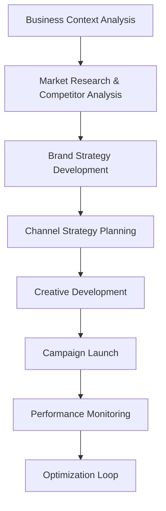
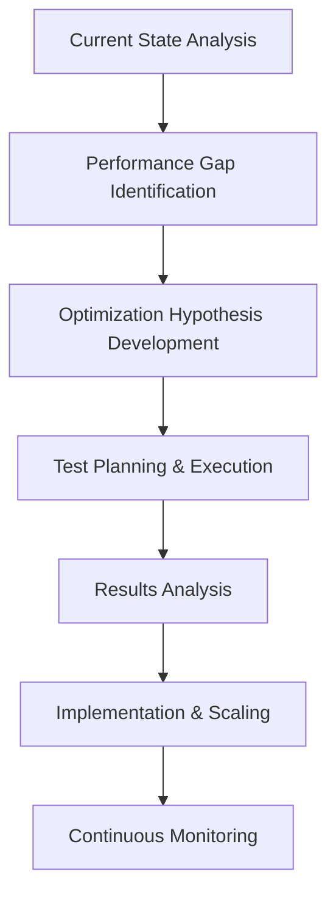
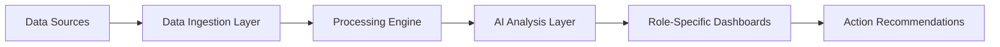

# BMAD Marketing Team Framework - Product Requirements Document

## Executive Summary

The BMAD Marketing Team Framework is an AI-driven marketing automation system that applies software development methodologies to marketing operations. Using the proven BMAD (Brand, Media, Analyst, Designer) structure with Greenfield/Brownfield workflows, this framework enables data-driven marketing decisions through intelligent automation and cross-functional collaboration.

## 1. Project Overview

### 1.1 Project Name

BMAD Marketing Team Framework

### 1.2 Project Type

**Adaptive Framework** - Supports both Greenfield (new product/market entry) and Brownfield (existing product optimization) marketing scenarios

### 1.3 Business Objective

Create an intelligent marketing team structure that:

- Automates data collection and analysis across marketing channels
- Provides role-specific prompts and workflows for optimal performance
- Integrates seamlessly with existing marketing technology stacks
- Delivers measurable ROI improvements through AI-driven insights

### 1.4 Non-Functional Requirements

- **Localization**: The system must support multilingual interactions. Specifically, if a user communicates in Korean, the AI agents must respond in fluent, natural-sounding Korean.

## 2. Target Market & Use Cases

### 2.1 Primary Business Types

- **SaaS Companies**: B2B software, subscription models
- **E-commerce**: B2C retail, marketplace sellers
- **Digital Agencies**: Client service providers
- **B2B Services**: Professional services, consulting
- **Startups**: Early-stage companies with limited marketing resources

### 2.2 Workflow Scenarios

#### Greenfield Marketing

- New product launches
- Market expansion initiatives
- Brand positioning development
- Initial go-to-market strategies

#### Brownfield Marketing

- Existing campaign optimization
- Channel performance improvement
- Creative refresh projects
- Conversion rate optimization

## 3. Team Structure & Roles

### 3.1 Brand Marketer (B)

**Core Responsibilities:**

- Brand strategy and positioning
- Content marketing oversight
- Brand awareness campaigns
- Customer journey mapping

**Required Data Inputs:**

- Brand sentiment analysis
- Share of voice metrics
- Customer feedback data
- Competitive positioning data

**Key Prompts:**

```
"Analyze current brand perception data and provide recommendations for positioning strategy based on [BUSINESS_TYPE] and [TARGET_MARKET]"

"Generate content calendar aligned with brand voice for [CAMPAIGN_OBJECTIVE] targeting [AUDIENCE_SEGMENT]"
```

### 3.2 Media Buyer/Performance Marketer (M)

**Core Responsibilities:**

- Paid advertising campaign management
- Budget allocation optimization
- Channel performance analysis
- ROI/ROAS optimization

**Required Data Inputs:**

- Cost Per Acquisition (CAC) by channel
- Return on Ad Spend (ROAS)
- Conversion tracking data
- Attribution modeling data

**Key Prompts:**

```
"Optimize ad spend allocation across channels based on current CAC of $[VALUE] and target CAC of $[TARGET] for [BUSINESS_TYPE]"

"Analyze performance data and recommend budget reallocation to achieve [BUSINESS_GOAL] within [TIMEFRAME]"
```

### 3.3 Analyst (A)

**Core Responsibilities:**

- Marketing analytics and reporting
- Customer segmentation analysis
- Performance forecasting
- Data integration management

**Required Data Inputs:**

- Google Analytics 4 data
- Customer lifecycle metrics
- Conversion funnel analysis
- Multi-touch attribution data

**Key Prompts:**

```
"Analyze customer journey data from GA4 and identify optimization opportunities for funnel conversion rates"

"Generate cohort analysis for [TIME_PERIOD] and predict customer lifetime value trends"
```

### 3.4 Designer (D)

**Core Responsibilities:**

- Creative asset development
- A/B testing design variations
- Brand visual consistency
- User experience optimization

**Required Data Inputs:**

- Creative performance metrics
- A/B testing results
- User engagement data
- Visual brand guidelines

**Key Prompts:**

```
"Create design variations for A/B testing based on performance data showing [CURRENT_METRICS] for [CAMPAIGN_TYPE]"

"Optimize visual elements for [CHANNEL] considering [AUDIENCE_DEMOGRAPHIC] and [CONVERSION_GOAL]"
```

## 4. Workflow Architecture

### 4.1 Greenfield Workflow



**Detailed Steps:**

1. **Business Context Analysis** (Analyst + Brand Marketer)

   - Industry landscape assessment
   - Target audience definition
   - Business goal alignment

2. **Market Research** (Analyst)

   - Competitive analysis
   - Market opportunity sizing
   - Customer persona development

3. **Brand Strategy** (Brand Marketer + Designer)

   - Brand positioning framework
   - Messaging hierarchy
   - Visual identity guidelines

4. **Channel Strategy** (Media Buyer + Analyst)

   - Channel selection matrix
   - Budget allocation framework
   - KPI definition

5. **Creative Development** (Designer + Brand Marketer)
   - Asset creation workflows
   - A/B testing planning
   - Content calendar development

### 4.2 Brownfield Workflow



**Detailed Steps:**

1. **Current State Analysis** (Analyst)

   - Historical performance review
   - Channel effectiveness audit
   - Customer behavior analysis

2. **Gap Identification** (All Roles Collaborative)

   - Performance vs. benchmark analysis
   - Opportunity prioritization
   - Resource requirement assessment

3. **Optimization Planning** (Media Buyer + Designer)
   - Test hypothesis development
   - Creative variation planning
   - Budget reallocation strategy

## 5. Technical Integration Requirements

### 5.1 Core Data Sources

#### Google Analytics 4 (GA4) Integration

- **Purpose**: Website traffic and conversion analysis
- **Implementation**: GA MCP (Model Context Protocol) integration
- **Data Points**:
  - User acquisition metrics
  - Conversion tracking
  - Audience segmentation
  - Attribution modeling

#### Supermetrics Integration

- **Purpose**: Cross-platform marketing data consolidation
- **Implementation**: CSV export/import automation
- **Data Sources**:
  - Facebook Ads
  - Google Ads
  - LinkedIn Ads
  - TikTok Ads
  - Email marketing platforms

#### CRM Integration

- **Purpose**: Customer lifecycle tracking
- **Implementation**: API connections or CSV imports
- **Data Points**:
  - Lead scoring
  - Customer acquisition cost
  - Lifetime value metrics
  - Sales attribution

### 5.2 Data Processing Architecture



**Components:**

- **Data Ingestion**: Automated collection from multiple sources
- **Processing Engine**: Data cleaning, normalization, and enrichment
- **AI Analysis Layer**: Machine learning models for insights generation
- **Dashboards**: Role-specific data visualization
- **Recommendations**: Actionable insights delivery

## 6. Data Requirements by Business Type

### 6.1 SaaS Business Requirements

**Critical Metrics:**

- Monthly Recurring Revenue (MRR) growth
- Customer Acquisition Cost (CAC) by channel
- Customer Lifetime Value (CLV)
- Churn rate by acquisition channel
- Product-qualified leads (PQL)

**Required Integrations:**

- Google Analytics 4
- Marketing automation platform (HubSpot, Marketo)
- CRM system (Salesforce, Pipedrive)
- Product analytics (Mixpanel, Amplitude)

### 6.2 E-commerce Business Requirements

**Critical Metrics:**

- Return on Ad Spend (ROAS) by channel
- Average Order Value (AOV)
- Conversion rate by traffic source
- Cart abandonment rate
- Customer lifetime value

**Required Integrations:**

- Google Analytics 4 Enhanced Ecommerce
- Shopify/WooCommerce data
- Email marketing platforms
- Social media advertising platforms

### 6.3 B2B Services Requirements

**Critical Metrics:**

- Lead generation cost by channel
- Lead-to-opportunity conversion rate
- Sales cycle length by source
- Customer acquisition cost
- Pipeline velocity

**Required Integrations:**

- CRM system
- Marketing automation platform
- Website analytics
- Social media management tools

## 7. Success Metrics & KPIs

### 7.1 Team Performance Metrics

#### Brand Marketer KPIs

- Brand awareness lift (+X% quarterly)
- Share of voice improvement
- Content engagement rates
- Brand sentiment score

#### Media Buyer KPIs

- Cost per acquisition reduction (-X% quarterly)
- Return on ad spend improvement (+X% quarterly)
- Channel diversification index
- Attribution accuracy rate

#### Analyst KPIs

- Data accuracy rate (>95%)
- Insight implementation rate (>80%)
- Forecast accuracy (+/-10%)
- Report delivery timeliness (100%)

#### Designer KPIs

- Creative performance improvement (+X% CTR)
- A/B test win rate (>60%)
- Asset production efficiency
- Brand compliance rate (100%)

### 7.2 Business Impact Metrics

- Overall marketing ROI improvement
- Customer acquisition cost reduction
- Customer lifetime value increase
- Market share growth
- Revenue attribution accuracy

## 8. Implementation Roadmap

### Phase 1: Foundation (Weeks 1-4)

- [ ] Business context assessment and team setup
- [ ] Core data integration implementation
- [ ] Role-specific prompt library development
- [ ] Initial workflow documentation

### Phase 2: Integration (Weeks 5-8)

- [ ] GA4 MCP integration testing
- [ ] Supermetrics data pipeline setup
- [ ] Cross-role collaboration workflow testing
- [ ] Performance baseline establishment

### Phase 3: Optimization (Weeks 9-12)

- [ ] AI-driven insight generation implementation
- [ ] Automated reporting system deployment
- [ ] Advanced analytics model training
- [ ] Performance optimization cycles

### Phase 4: Scaling (Weeks 13-16)

- [ ] Multi-business-type workflow adaptation
- [ ] Advanced automation features
- [ ] Predictive analytics implementation
- [ ] Continuous improvement processes

## 9. Risk Assessment & Mitigation

### 9.1 Technical Risks

**Risk**: Data integration complexity
**Mitigation**: Phased implementation with fallback manual processes

**Risk**: AI model accuracy
**Mitigation**: Human oversight and validation loops

### 9.2 Business Risks

**Risk**: Team adoption resistance
**Mitigation**: Comprehensive training and gradual rollout

**Risk**: ROI measurement complexity
**Mitigation**: Clear attribution models and success metrics

## 10. Resource Requirements

### 10.1 Technical Resources

- Data integration specialist (1 FTE)
- AI/ML engineer (0.5 FTE)
- Marketing operations manager (1 FTE)

### 10.2 Tools & Platforms

- Google Analytics 4 (Free/Paid)
- Supermetrics ($100-500/month)
- Marketing automation platform ($50-2000/month)
- AI analysis tools ($100-1000/month)

### 10.3 Training & Implementation

- Initial setup: 40 hours
- Team training: 20 hours per role
- Ongoing optimization: 10 hours/month

## 11. Success Criteria

### 11.1 Immediate Success (3 months)

- Complete data integration across all channels
- Role-specific workflows operational
- 20% improvement in data-driven decision speed

### 11.2 Medium-term Success (6 months)

- 15% improvement in a- [ ] nal marketing ROI
- 25% reduction in manual reporting time
- 90% team adoption rate

### 11.3 Long-term Success (12 months)

- 30% improvement in customer acquisition efficiency
- Predictive analytics accuracy >80%
- Framework replication across business units

## 12. Next Steps

1. **Business Type Assessment**: Determine primary business model and requirements
2. **Current State Analysis**: Audit existing marketing stack and processes
3. **Integration Planning**: Design technical architecture for data connections
4. **Team Formation**: Assign roles and establish collaboration workflows
5. **Pilot Implementation**: Start with single business unit or campaign
6. **Performance Monitoring**: Establish measurement and optimization cycles

---

**Document Version**: 1.0  
**Last Updated**: [Current Date]  
**Next Review**: [30 days from creation]
