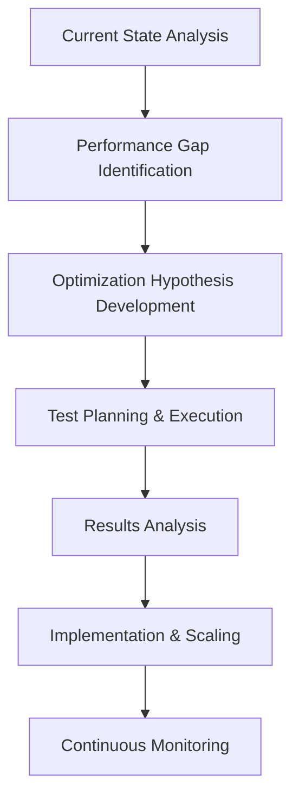

# Brownfield Marketing Workflow

This document outlines the step-by-step process for optimizing an existing product or campaign using the BMAD framework.

## Workflow Diagram

## Detailed Steps & Responsibilities

1.  **Current State Analysis** (Analyst)

    - **Task:** Review historical performance data and audit the effectiveness of current channels.
    - **Output:** A performance audit report.

2.  **Gap Identification** (All Roles)

    - **Task:** Collaboratively identify areas for improvement by comparing performance against benchmarks.
    - **Output:** A prioritized list of optimization opportunities.

3.  **Optimization Hypothesis** (Media Buyer + Designer)

    - **Task:** Develop a clear, testable hypothesis for how to improve performance.
    - **Output:** A documented A/B test plan.

4.  **Test Execution** (Media Buyer + Designer)

    - **Task:** Launch the A/B test and monitor its execution.
    - **Output:** The test is live.

5.  **Results Analysis** (Analyst)
    - **Task:** Analyze the results of the test to determine if the hypothesis was correct.
    - **Output:** A test results report with a clear "winner" and statistical significance.
