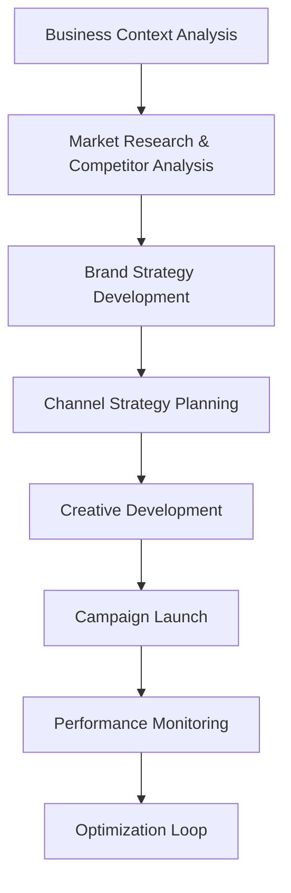

# Greenfield Marketing Workflow

This document outlines the step-by-step process for launching a new product or entering a new market using the BMAD framework.

## Workflow Diagram

## Detailed Steps & Responsibilities

1.  **Business Context Analysis** (Analyst + Brand Marketer)

    - **Task:** Analyze the industry landscape, define the target audience, and align on business goals.
    - **Output:** A summary document in `docs/project-planning`.

2.  **Market Research** (Analyst)

    - **Task:** Conduct competitive analysis and develop customer personas.
    - **Output:** A market research report.

3.  **Brand Strategy** (Brand Marketer + Designer)

    - **Task:** Develop the brand positioning framework, messaging, and visual identity.
    - **Output:** A brand guidelines document.

4.  **Channel Strategy** (Media Buyer + Analyst)

    - **Task:** Select the appropriate marketing channels and define the budget allocation and KPIs.
    - **Output:** A channel strategy plan.

5.  **Creative Development** (Designer + Brand Marketer)
    - **Task:** Create all necessary marketing assets, including ad creatives, landing pages, and content.
    - **Output:** All creative assets stored in a shared drive.
